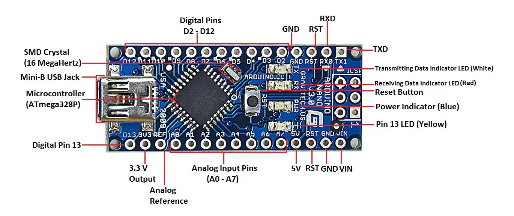

# Arduino Nano Guide and Technical Overview



## Table of Contents
- [Arduino Nano Basics](#arduino-nano-basics)
- [Getting Started](#getting-started)
- [Pin Layout](#pin-layout)
- [Common Components](#common-components)
- [Programming Essentials](#programming-essentials)
- [Safety Guidelines](#safety-guidelines)
- [Troubleshooting](#troubleshooting)
- [Advanced Topics](#advanced-topics)

## Arduino Nano Basics

The Arduino Nano is a compact, breadboard-friendly microcontroller board based on the ATmega328P (or ATmega168 in older versions). It provides similar functionality to the Arduino UNO in a smaller form factor.

### Key Specifications
- Operating Voltage: 5V
- Input Voltage: 7-12V recommended (6-20V limits)
- Digital I/O Pins: 14 (6 PWM pins)
- Analog Input Pins: 8 (A0-A7)
- Flash Memory: 32 KB (ATmega328P)
- SRAM: 2 KB
- EEPROM: 1 KB
- Clock Speed: 16 MHz
- Current per I/O Pin: 20 mA
- USB Connection: Mini-B USB

## Getting Started

### Software Requirements
1. Download Arduino IDE from [official website](https://www.arduino.cc/en/software)
2. Install CH340 driver for most Nano clones
3. Select "Arduino Nano" from Tools → Board menu
4. Choose appropriate processor (ATmega328P or ATmega168)
5. Select correct COM port

### First-Time Setup
1. Connect Nano using Mini-B USB cable
2. Install necessary drivers
3. Verify connection in Device Manager
4. Upload basic blink sketch to confirm functionality

## Pin Layout

### Digital Pins (D2-D13)
- Pins 2-13: Digital INPUT/OUTPUT
- Pins 3, 5, 6, 9, 10, 11: PWM output (~)
- Pins 0 (RX), 1 (TX): Serial communication
- Maximum current: 20 mA per pin

### Analog Pins (A0-A7)
- 8 analog inputs 
- 10-bit resolution (0-1023 values)
- Can function as digital I/O
- A4 (SDA), A5 (SCL): I2C communication

### Power Pins
- VIN: Input voltage
- 5V: Regulated power output
- 3.3V: Regulated power output
- GND: Ground connections
- RESET: Board reset
- AREF: Analog reference voltage

## Differences from Arduino UNO
- Smaller form factor
- Mini-B USB instead of Type-B
- Identical pin functionality
- Slightly different pin positioning
- More compact design for breadboard integration

## Common Components

### Working with LEDs
- Use 220Ω-330Ω current-limiting resistors
- Connect longer leg (anode) to Arduino pin
- Connect shorter leg (cathode) to ground
- Maximum current: 20 mA per LED

### Sensor Interfaces
- 5V logic level
- Support for multiple communication protocols
- Pull-up/pull-down resistors recommended
- Ensure proper voltage regulation

### Power Considerations
- USB power: 5V from computer
- External power: 7-12V recommended
- Use voltage regulators for stable power
- Consider current requirements of attached components

## Programming Essentials

### Basic Sketch Structure
```cpp
void setup() {
    // Initialization code
    Serial.begin(9600);  // Initialize serial communication
    pinMode(LED_PIN, OUTPUT);  // Set pin modes
}

void loop() {
    // Main program code
    // Continuously executed
}
```

### Important Functions
- `pinMode()`: Configure pin mode
- `digitalWrite()`: Set digital pin state
- `digitalRead()`: Read digital pin
- `analogWrite()`: PWM output
- `analogRead()`: Read analog value
- `delay()`: Pause program execution

## Safety Guidelines

### Hardware Protection
1. Use appropriate current-limiting resistors
2. Avoid exceeding voltage limits
3. Ensure proper grounding
4. Protect from static electricity
5. Use stable power supplies

### Best Practices
1. Start with simple circuits
2. Test components individually
3. Use breadboard for prototyping
4. Document modifications
5. Check connections before powering

## Troubleshooting

### Common Issues
1. Driver Problems
   - Install CH340 driver
   - Verify USB connection
   - Try different USB ports
   - Update Arduino IDE

2. Upload Errors
   - Select correct board
   - Verify COM port
   - Check board/processor selection
   - Restart Arduino IDE

3. Power and Connection Issues
   - Use quality USB cable
   - Check power supply
   - Verify voltage levels
   - Test with minimal configuration

## Advanced Topics

### Communication Protocols
- Serial (UART)
- I2C
- SPI
- Software serial implementation

### Power Management
- Low-power modes
- External power options
- Current optimization techniques

## Resources
- [Official Arduino Documentation](https://www.arduino.cc/reference/en/)
- [Arduino Nano Tutorials](https://www.arduino.cc/en/Tutorial/HomePage)
- [Community Forums](https://forum.arduino.cc/)

---