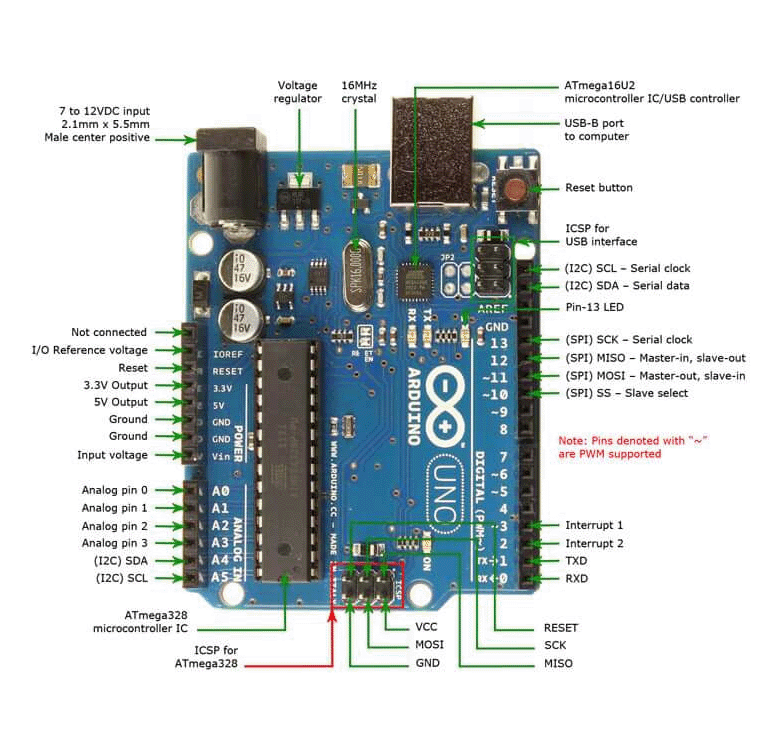

# Arduino UNO Guide and Technical Overview



## Table of Contents
- [Arduino UNO Basics](#arduino-uno-basics)
- [Getting Started](#getting-started)
- [Pin Layout](#pin-layout)
- [Common Components](#common-components)
- [Programming Essentials](#programming-essentials)
- [Circuit Diagrams](#circuit-diagrams)
- [Safety Guidelines](#safety-guidelines)
- [Troubleshooting](#troubleshooting)
- [Advanced Topics](#advanced-topics)

## Arduino UNO Basics

The Arduino UNO is a microcontroller board based on the ATmega328P. It's perfect for beginners and versatile enough for advanced projects.

### Key Specifications
- Operating Voltage: 5V
- Input Voltage: 7-12V recommended (6-20V limits)
- Digital I/O Pins: 14 (6 PWM pins)
- Analog Input Pins: 6
- Flash Memory: 32 KB
- Clock Speed: 16 MHz
- Current per I/O Pin: 20 mA
- USB Connection: Type-B

## Getting Started

### Software Requirements
1. Download Arduino IDE from [official website](https://www.arduino.cc/en/software)
2. Install required drivers (usually automatic with IDE installation)
3. Select "Arduino UNO" from Tools → Board menu
4. Select appropriate COM port from Tools → Port

### First-Time Setup
1. Connect Arduino using USB cable
2. Verify connection via Device Manager (Windows) or System Report (Mac)
3. Test with basic blink sketch (File → Examples → Basics → Blink)
4. Install necessary libraries through Library Manager

## Pin Layout

### Digital Pins (0-13)
- Pins 0-13: Digital INPUT/OUTPUT
- Pins 3, 5, 6, 9, 10, 11: PWM output (~)
- Pins 0 (RX), 1 (TX): Serial communication
- Pin 13: Built-in LED
- Maximum current: 20mA per pin

### Analog Pins (A0-A5)
- 6 analog inputs (A0-A5)
- 10-bit resolution (0-1023 values)
- Can also function as digital I/O
- A4 (SDA), A5 (SCL): I2C communication

### Power Pins
- VIN: Input voltage
- 5V: Regulated power output
- 3.3V: Regulated power output (maximum current: 50mA)
- GND: Ground pins
- RESET: Resets the board
- IOREF: Reference voltage for shields

## Common Components

### Working with LEDs
- Always use current-limiting resistors (220Ω-330Ω typical)
- Connect longer leg (anode) to Arduino pin
- Connect shorter leg (cathode) to ground
- Maximum current: 20mA per LED

### Using Sensors
- Check voltage requirements (most use 5V)
- Use pull-up/pull-down resistors when needed
- Verify signal voltage levels
- Proper grounding is essential
- Consider noise reduction techniques

### Motor Control
- Use external power supply for motors
- L298N motor driver required for DC motors
- Check current requirements
- Use capacitors for noise suppression
- Ensure proper heat dissipation

## Programming Essentials

### Basic Sketch Structure
```cpp
void setup() {
    // Initialization code
    Serial.begin(9600);  // Initialize serial communication
    pinMode(LED_PIN, OUTPUT);  // Set pin modes
}

void loop() {
    // Main program code
    // This runs continuously
}
```

### Important Functions
- `pinMode(pin, mode)`: Set pin as INPUT or OUTPUT
- `digitalRead(pin)`: Read digital pin state
- `digitalWrite(pin, value)`: Set digital pin HIGH or LOW
- `analogRead(pin)`: Read analog value (0-1023)
- `analogWrite(pin, value)`: Write PWM value (0-255)
- `delay(ms)`: Pause program execution
- `millis()`: Get current runtime in milliseconds

## Circuit Diagrams

Basic connection diagrams for each component:

### LED Connection
```
Arduino Pin --> Resistor (220Ω) --> LED(+) --> GND
```

### IR Sensor
```
VCC --> 5V
GND --> GND
OUT --> Digital Pin
```

### Ultrasonic Sensor
```
VCC --> 5V
GND --> GND
TRIG --> Digital Pin
ECHO --> Digital Pin
```

### Motor Driver (L298N)
```
ENA/ENB --> PWM Pins
IN1-IN4 --> Digital Pins
12V --> External Power
GND --> Arduino GND + Power GND
```

## Safety Guidelines

### Hardware Protection
1. Always use appropriate resistors
2. Never exceed voltage limits
3. Double-check connections before power-up
4. Use heat sinks when necessary
5. Protect board from static electricity

### Best Practices
1. Start with simple circuits
2. Test components individually
3. Document your modifications
4. Use breadboards for prototyping
5. Keep components well-organized

## Troubleshooting

### Common Issues

1. Board Not Recognized
   - Check USB cable connection
   - Verify COM port selection
   - Reinstall drivers if necessary
   - Try different USB ports

2. Upload Errors
   - Confirm board selection in IDE
   - Check if serial port is in use
   - Reset board before upload
   - Verify sketch syntax

3. Circuit Problems
   - Verify pin connections
   - Check power supply voltage
   - Ensure proper ground connections
   - Look for loose wires
   - Test components individually

## Advanced Topics

### Serial Communication
- Serial Monitor for debugging
- Hardware serial vs Software serial
- Common baud rates: 9600, 115200

### Power Management
- USB power vs External power
- Voltage regulation considerations
- Current limitations and requirements

## Resources

### Online Simulation
- Use [Wokwi](https://wokwi.com/) for testing
- Create virtual circuits
- Test code before hardware implementation
- Share simulations with others

### Useful Links
- [Arduino Crashcourse](https://youtu.be/BLrHTHUjPuw?si=-G1NdzcwP8NKVlOq)
- [Arduino Official Documentation](https://www.arduino.cc/reference/en/)
- [Arduino Forum](https://forum.arduino.cc/)
- [Project Examples](https://www.arduino.cc/en/Tutorial/HomePage)

---